# Compost

Customizable Web Components and utilities for interactive UIs, in the browser
or a native app's webview. Audio apps are one use, not a requirement.

The components provide useful default presentation and interaction, emit intent
as DOM events, and can receive values without emitting new intent. A knob fires
`parameter-edit` with a parameter ID and a value, and an editor
fires `envelope-change` with the new points. The consuming application
decides what those edits mean and can synchronize the controls with its own
state. Local interaction works without a controller or backend.

## Install

It is plain ES modules with no build step, so either route works.

As a submodule, which is how I use it most often:

```sh
git submodule add https://github.com/charCulbert/compost vendor/compost
```

Then point a `file:` dependency at it so the `compost/...` import paths
resolve, or serve the folder directly and import from `vendor/compost/src`.

Or from GitHub with npm, which pins to a commit:

```sh
npm install github:charCulbert/compost
```

```js
import 'compost/components/compost-knob';
import { createParameterController } from 'compost/parameter-controller';
```

## What's in it

Controls: `compost-knob`, `compost-slider`, `compost-number-box`,
`compost-button`, `compost-select`.

<details><summary><code>compost-knob</code></summary>

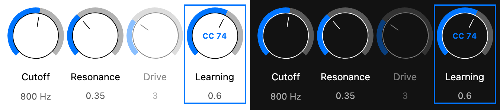

</details>
<details><summary><code>compost-slider</code></summary>

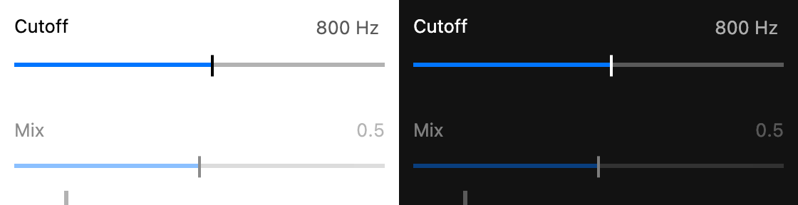

</details>

Displays: `compost-meter`, `compost-scope`, `compost-spectrogram`,
`compost-waveform`.

<details><summary><code>compost-meter</code></summary>

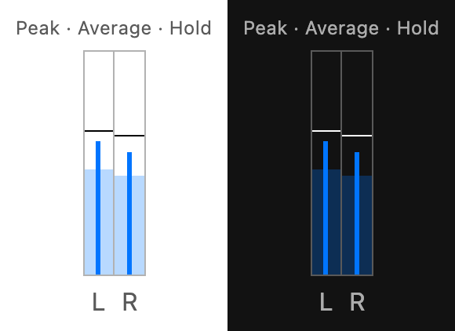

</details>
<details><summary><code>compost-scope</code></summary>

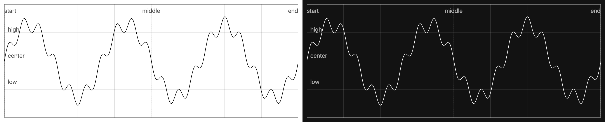

</details>
<details><summary><code>compost-spectrogram</code></summary>

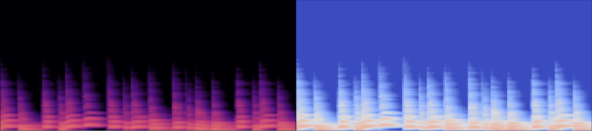

</details>

Editors: `compost-envelope-editor`, `compost-note-editor`,
`compost-audio-clip-editor`, `compost-clip-grid`, `compost-timeline`.

<details><summary><code>compost-envelope-editor</code></summary>

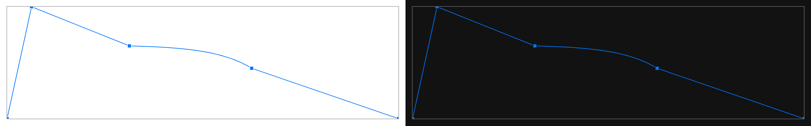

</details>
<details><summary><code>compost-note-editor</code></summary>

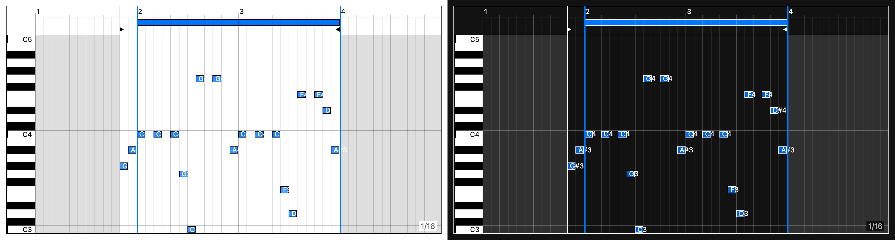

</details>
<details><summary><code>compost-audio-clip-editor</code></summary>

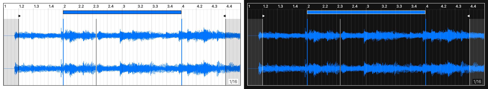

</details>
<details><summary><code>compost-clip-grid</code></summary>

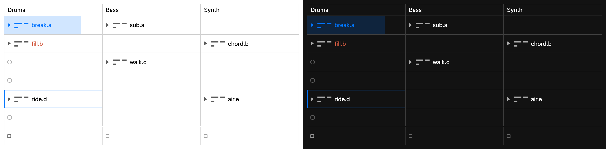

</details>
<details><summary><code>compost-timeline</code></summary>

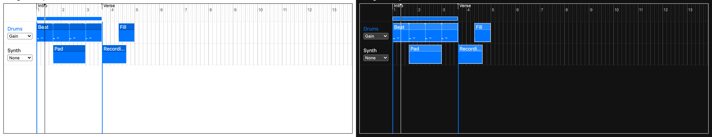

</details>

Input: `compost-piano`, a playable keyboard that emits note events.

<details><summary><code>compost-piano</code></summary>

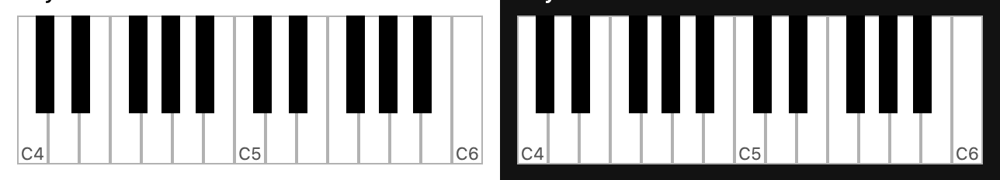

</details>

Panels: `compost-drawer`, `compost-window`, `compost-popup`.

Devices: `compost-audio`, `compost-midi`, `compost-device-selector`,
`compost-midi-monitor`, `compost-midi-mappings`.

Utilities: `parameter-controller` (wires controls to your backend),
`value-control` (numeric controls with your own graphics),
`parameter-scale` (linear/log/gain curves), `midi`, `midi-mapping`,
`midi-mappings`, `midi-learn-ui`, `device-settings`, `envelope-model`,
`piano-roll-model`, `selection-region`, `time-grid`, `touch-double-click`
and `utils`.

Each element's attributes, properties and events are declared in its type
declaration next to the source (`src/components/<element>.d.ts`), and every
element has an [example page](https://charculbert.github.io/compost/).

## Events

Controls fire `parameter-begin`, `parameter-edit` and `parameter-end`, each
carrying the parameter ID and the value in real units. That's the
begin / change / end shape many plugin APIs use, so a plugin UI can pass
them straight through.

```js
{ parameterID, value, kind: 'continuous' | 'discrete' | 'trigger', source, cancelled }
```

Editors fire `<thing>-input` while you drag and `<thing>-change` when you
let go (`envelope`, `loop`, `range`, `automation`, and `time-select-input` /
`time-select`). Both carry the same payload, so you can preview the drag or
wait for the commit. `notes-change` stands alone: the note editor commits
each change as it happens.

Escape cancels a gesture. The element snaps back and a control sends
`parameter-end` with `cancelled: true`.

Right-click or long-press fires `<thing>-context` with
`clientX` / `clientY`. The application decides what the menu contains.

`compost-piano` sends `note-down` and `note-up`.

## Keyboard and touch

Across the editors: Command/Ctrl inverts time snapping, Shift gives fine
control on value drags and extends selection on item drags, Alt copies.
Double-click resets a control; on touch, double-tap does.

Touch: one finger edits or selects, long-press opens context, two fingers
pinch to zoom and pan. The note editor pinches horizontally for time and
vertically for pitch. A number-box tap opens its editor while a drag still
adjusts it. Number-box keyboard steps are anchored at `min`, matching its
displayed step grid.

## Talking to a backend

`createParameterController()` collects every control with a `parameter-id`,
forwards their events, and pushes values back without firing them again, so
automation and MIDI never loop.

```js
import { createParameterController } from 'compost/parameter-controller';

const parameters = createParameterController({ root: document });
parameters.addEventListener('parameter-edit', ({ detail }) => {
  backend.setValue(detail.parameterID, detail.value);
});
backend.onValue = (id, value) => parameters.applyValue(id, value, { source: 'backend' });
```

`backend.setValue()` can set a Web Audio `AudioParam`, post to an
AudioWorklet, call a WebView bridge, or update ordinary application state.
Pass `definitions` for parameter
metadata; without it, the first matching control supplies the range,
default, step, values and unit.

`parameter-scale` maps values to positions the way the controls do: `curve`
is `linear`, `log` or `gain`; `mid` puts a chosen value at the centre. The
`gain` curve is a fader response over dB (`-12 dB` at 50%, `0 dB` at 70%).

`createMIDIMappings({ parameterProvider: parameters })` stores one CC per
parameter, handles incoming messages, and drives `compost-midi-mappings` and
MIDI learn; ranges follow the parameter's curve.

## Bring your own graphics

For graphics beyond the built-in numeric controls, `value-control` supplies
numeric dragging, keyboard input, accessibility attributes and the same parameter
events. You supply the drawing, including visible focus.

```js
import { createValueControl } from 'compost/value-control';

const amount = createValueControl(document.querySelector('#amount'), {
  parameterID: 'amount',
  label: 'Amount',
  min: 0,
  max: 1,
  value: 0.25,
  step: 0.01,
  draw: ({ position, valueText, focused }) => {
    drawAmount({ position, valueText, focused });
  },
});
amount.setValue(0.75); // Updates silently.
// Call amount.dispose() when removing the control.
```

Set `touch-action: none` on the drag surface. To synchronize with other controls,
register it with `parameters.registerControl(amount)`. See the
[custom canvas example](examples/custom-controls/) for hit testing, synchronization
and cleanup, and the [API types](src/value-control.d.ts) for drag and editor options.

## Element notes

Things that only apply to one element and aren't obvious from its type
declaration.

**`compost-button`** supports `mode="cycle"` for a discrete choice displayed as
a button. Put the visible choices in `text="First|Second|Third"` and provide a
stable `label`; pressing advances and Shift-pressing reverses. Arrows move in
their direction and Home/End select the endpoints. Incoming `setValue()` and
controller values update the displayed choice silently.

**`compost-waveform`** takes `{ min, max }` peak buckets per channel:
`peaks = [mono]` or `peaks = [left, right]`. Decoding and peak generation
are host policy.

**`compost-spectrogram`** displays timestamped frequency columns from your
analyser. Supply columns with `appendColumns(values, { startTime, timeStep })`
and row frequencies with `frequencies`. It keeps a bounded history and handles
scrolling and colour mapping; audio capture, FFT and unit conversion stay in the
host. See the [example](examples/compost-spectrogram/) and
[API types](src/components/compost-spectrogram.d.ts) for palettes, frequency scales
and playback positioning.

**`compost-audio-clip-editor`** wraps that waveform with clip metadata and
editing. It has no gain control of its own: set `gain` (in dB) to the
host's clip gain and the waveform scales vertically to match. Dropping a
file emits `audio-file-drop`.

**Meter and grid** (note editor, audio clip editor, timeline):
`time-signature="N/D"` with `D` in 1, 2, 4, 8, 16. Model time is always
quarter-note beats; the denominator only affects ruler counting. Grid
values are note values like `1/8`, `1/16T` or `bar`. `adaptive-grid` lets
zoom pick the step; `adaptive-grid-density` (0.125 to 8, default 1) tunes it.
The elements don't model meter changes within a song, for example; that
stays host data.

**`compost-note-editor`** does not quantize notes itself. It emits
`note-quantize` with the selected IDs and grid step, and the application
decides what that means: open a settings menu, quantize with its own
strength and swing, and so on. Command/Ctrl on a note body edits velocity.

**`compost-clip-grid`** renders a session launcher from `setTracks()` and
owns the cursor, selection and drag geometry. `clips-copy` / `-cut` /
`-paste` / `-delete` / `-duplicate` / `-move` carry track IDs and slot
coordinates, including selected empty slots. The host owns the clipboard, new
IDs, collision policy and undo. Store empty slots as `null` to reproduce a
copied rectangle exactly. Shift or a drag from an empty slot does
rectangular selection, Command/Ctrl does sparse selection.

**`compost-timeline`** has one selection: a beat interval across contiguous
lanes. Dragging a clip title emits `time-move-input` then `time-move` for
every intersecting slice; the host owns splitting, collisions and whether
automation follows (the timeline never moves it for you). `time-duplicate`
asks the host to copy the selected span right after itself. With the
`automation` attribute, a lane shows the curve the host picks via
`lane.automation` or `setLaneAutomation()` over dimmed clips. Follow mode
only re-anchors while `playing` is present. Command/Ctrl-wheel zooms time,
Alt-wheel scales lane height, arrows move the selection, Shift+Arrow grows
it, Command/Ctrl+A selects the bounds within which all the clips lie.

## Working on it

`npm run dev` serves the examples in `examples/<element>/`.
`npm run check` checks formatting and lint; `npm test` runs unit tests and
`npm run test:e2e` runs browser tests. To check one example headlessly, run
`node examples/check-example.mjs <element>`.
